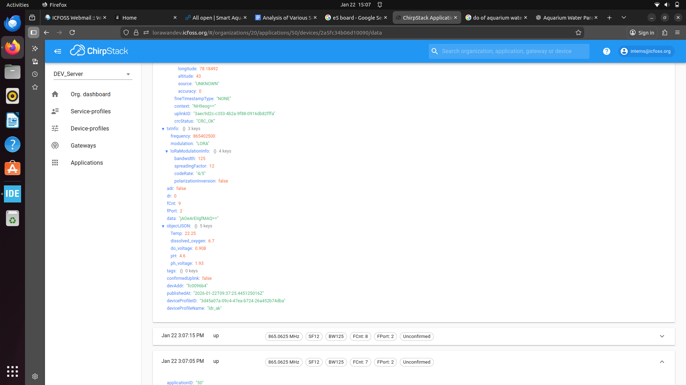
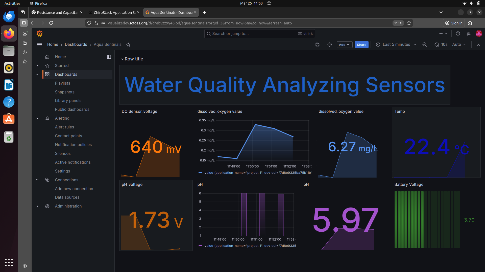

# 🌊 Water Quality Monitoring System

A real-time **Water Quality Monitoring System** developed using an **STM32 BL072CZLRWAN1 microcontroller** to measure essential water quality parameters including **pH**, **Dissolved Oxygen (DO)**, and **Water Temperature**. The collected sensor data is processed by the STM32 and transmitted wirelessly using **LoRaWAN** for remote monitoring through **ChirpStack** and **Grafana**.

---

# 📑 Table of Contents

- [Overview](#-overview)
- [Features](#-features)
- [Hardware Components](#-hardware-components)
- [System Workflow](#-system-workflow)
- [Experimental Setup](#-experimental-setup)
- [Measured Parameters](#-measured-parameters)
- [Data Transmission](#-data-transmission)
- [Project Structure](#-project-structure)
- [Project Images](#-project-images)
- [Applications](#-applications)
- [Software & Tools](#-software--tools)
- [Future Improvements](#-future-improvements)
- [Author](#-author)

---

# 📖 Overview

Water quality plays an important role in environmental monitoring, aquaculture, water treatment, and research applications. This project provides a reliable and scalable solution for continuously monitoring essential water quality parameters.

The system measures pH, dissolved oxygen, and water temperature using dedicated sensors interfaced with an STM32 microcontroller. The processed data is transmitted over a LoRaWAN network and visualized using ChirpStack and Grafana for real-time monitoring.

---

# ✨ Features

- 📊 Real-time pH monitoring
- 💧 Dissolved Oxygen (DO) measurement
- 🌡 Water temperature monitoring
- 📡 LoRaWAN-based wireless communication
- 📈 Real-time visualization using Grafana
- ⚙️ Sensor calibration support
- 🔋 Suitable for remote monitoring
- 🧩 Modular firmware for future expansion

---

# 🛠 Hardware Components

| Component | Description |
|-----------|-------------|
| STM32 Microcontroller | Main Controller |
| DFRobot Analog pH Sensor | pH Measurement |
| DFRobot Analog Dissolved Oxygen Sensor | Dissolved Oxygen Measurement |
| DS18B20 Waterproof Sensor | Water Temperature |
| LoRaWAN Module | Wireless Communication |
| LoRaWAN Gateway | Receives Sensor Data |
| ChirpStack | LoRaWAN Network Server |
| Grafana | Data Visualization |

---

# ⚙ System Workflow

```
        Water Sample
             │
     ┌───────┼────────┐
     │       │        │
 pH Sensor DO Sensor DS18B20
     │       │        │
     └───────┼────────┘
             │
         STM32 MCU
             │
      Data Processing
             │
      LoRaWAN Module
             │
     LoRaWAN Gateway
             │
        ChirpStack
             │
          Grafana
```

---

# 🧪 Experimental Setup

The complete hardware setup, calibration procedures, wiring connections, and testing methodology are available in the setup guide.

📄 **[Experimental Setup Guide](Hardware/setup guide.pdf)**

---

# 📊 Measured Parameters

## 🧪 pH

Measures the acidity or alkalinity of water.

Typical Range:

- Acidic : pH < 7
- Neutral : pH = 7
- Alkaline : pH > 7

---

## 💧 Dissolved Oxygen (DO)

Measures the amount of oxygen dissolved in water.

Applications include:

- Aquaculture
- Water Treatment
- Environmental Monitoring

---

## 🌡 Water Temperature

Measured using the DS18B20 waterproof digital temperature sensor.

Temperature affects:

- Dissolved Oxygen
- Chemical Reactions
- Aquatic Life

---

# 📡 Data Transmission

The STM32 performs the following tasks:

1. Reads sensor values.
2. Processes the acquired data.
3. Creates a LoRaWAN payload.
4. Transmits the payload through the LoRaWAN module.
5. Sends data to the LoRaWAN Gateway.
6. ChirpStack receives and decodes the payload.
7. Grafana visualizes the received data.

---

# 📂 Project Structure

```
Aquasentinals/
│
├── README.md
├── docs/
│   └── setup.pdf
├── Images/
│   ├── hardware_setup.jpg
│   ├── circuit_diagram.png
│   ├── chirpstack_dashboard.png
│   └── grafana_dashboard.png
├── Hardware/
└── Software/
```

---

# 📷 Project Images

## Circuit Diagram


---

## ChirpStack Dashboard



---

## Grafana Dashboard



---

# 🚀 Applications

- Water Quality Monitoring
- Aquaculture
- Fish Farming
- Environmental Monitoring
- Smart Agriculture
- Research Laboratories
- Industrial Water Monitoring

---

# 🧰 Software & Tools

- STM32CubeIDE
- STM32 HAL Libraries
- LoRaWAN Stack
- ChirpStack
- Grafana

---

# 📈 Future Improvements

- Turbidity Sensor Integration
- Electrical Conductivity (EC) Monitoring
- Total Dissolved Solids (TDS)
- ORP Sensor Integration
- Cloud-Based Dashboard
- Mobile Application
- Data Logging
- Remote Device Configuration

---

# 🤝 Contributing

Contributions, suggestions, and improvements are welcome.

1. Fork the repository
2. Create a new branch
3. Commit your changes
4. Submit a Pull Request

---

# 📜 License

This project is released under the **MIT License**.

---

# 👨‍💻 Author

**Akhil Kumar AR**

Embedded Systems | IoT | LoRaWAN

GitHub: **https://github.com/Akhilkumar8137**

---

⭐ **If you found this project useful, consider giving it a Star!**
